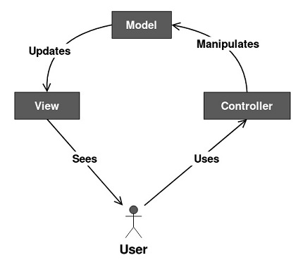

**Creating a calculator in python using MVC framework**  
===============================================

STEP 1: Create test.py
======================

**This file is used to test the installation of PyQt5**

    import sys

    from PyQt5.QtWidgets import QApplication
    from PyQt5.QtWidgets import QLabel
    from PyQt5.QtWidgets import QWidget

    app = QApplication(sys.argv)

    window = QWidget()
    window.setWindowTitle('PyQt5 App')
    window.setGeometry(100, 100, 280, 80)
    window.move(600, 15)
    helloMsg = QLabel('This is Test', parent=window)
    helloMsg.move(60, 30)

    window.show()

    sys.exit(app.exec_())x

STEP 2: Create view.py
======================

**The View file represents the files, which interact with the end user. It represents the model’s data to user.**

    from PyQt5.QtCore import Qt

    from PyQt5.QtWidgets import QMainWindow
    from PyQt5.QtWidgets import QWidget
    from PyQt5.QtWidgets import QGridLayout
    from PyQt5.QtWidgets import QLineEdit
    from PyQt5.QtWidgets import QPushButton
    from PyQt5.QtWidgets import QVBoxLayout
    class GUI(QMainWindow):
        """PyCalc's View (GUI)."""
        def __init__(self):
            """View initializer."""
            super().__init__()

            # Set some main window's properties
            self.setWindowTitle('Calculator')
            self.setFixedSize(235, 235)

            # Set the central widget and the general layout
            self.generalLayout = QVBoxLayout()

            # Set the central widget
            self._centralWidget = QWidget(self)
            self.setCentralWidget(self._centralWidget)

            self._centralWidget.setLayout(self.generalLayout)

            # Create the display and the buttons
            self._createDisplayLED()
            self._createButtons()

        def _createDisplayLED(self):
            """Create the display."""
            
            # Create the display widget
            self.display = QLineEdit()
            # Set some display's properties
            self.display.setFixedHeight(35)
            self.display.setAlignment(Qt.AlignRight)
            self.display.setReadOnly(True)
            
            # Add the display to the general layout
            self.generalLayout.addWidget(self.display)

        def _createButtons(self):
            """Create the buttons."""
            self.buttons = {}
            buttonsLayout = QGridLayout()
            # Button text | position on the QGridLayout
            buttons = {'7': (0, 0),
                       '8': (0, 1),
                       '9': (0, 2),
                       '/': (0, 3),
                       'C': (0, 4),
                       '4': (1, 0),
                       '5': (1, 1),
                       '6': (1, 2),
                       '*': (1, 3),
                       '(': (1, 4),
                       '1': (2, 0),
                       '2': (2, 1),
                       '3': (2, 2),
                       '-': (2, 3),
                       ')': (2, 4),
                       '0': (3, 0),
                       '00': (3, 1),
                       '.': (3, 2),
                       '+': (3, 3),
                       '=': (3, 4),
                      }

            # Create the buttons and add them to the grid layout
            for btnText, pos in buttons.items():
                self.buttons[btnText] = QPushButton(btnText)
                self.buttons[btnText].setFixedSize(40, 40)
                buttonsLayout.addWidget(self.buttons[btnText], pos[0], pos[1])
            # Add buttonsLayout to the general layout
            self.generalLayout.addLayout(buttonsLayout)

        def setDisplayText(self, text):
            """Set display's text."""
            self.display.setText(text)
            self.display.setFocus()

        def getDisplayText(self):
            """Get display's text."""
            return self.display.text()

        def clearDisplay(self):
            """Clear the display."""
            self.setDisplayText('')

STEP 3: Create main.py
======================

**The aim of the main file to test the view file** 

    import sys

    from PyQt5.QtWidgets import QApplication
    from view import GUI

    def main():
        """Main function."""
        # Create an instance of QApplication
        pycalc = QApplication(sys.argv)
        # Show the calculator's GUI
        view = GUI()
        view.show()

        sys.exit(pycalc.exec_())

    if __name__ == '__main__':
	     main()

STEP 4: Create model.py
======================

**The Model component corresponds to all the data-related logic that the user works with. This can represent either the data that is being transferred between the View and Controller components or any other business logic-related data.**

    ERROR_MSG = 'ERROR'

    # Create a Model to handle the calculator's operation
    def evaluateExpression(expression):
        """Evaluate an expression."""
        try:
            result = str(eval(expression, {}, {})) 
        except Exception:
            result = ERROR_MSG

        return result

STEP 5: Update main.py
======================

**Update the main file in order to test the model file also**

    from  model import evaluateExpression
    ...
    model = evaluateExpression

**The final code after updation of model file:**

    import sys

    from PyQt5.QtWidgets import QApplication
    from view import GUI
    from  model import evaluateExpression

    # Client code
    def main():
        """Main function."""
        # Create an instance of QApplication
        pycalc = QApplication(sys.argv)
        # Show the calculator's GUI
        view = GUI()
        view.show()

        model = evaluateExpression

        sys.exit(pycalc.exec_())

    if __name__ == '__main__':
      main()

STEP 6: Create controller.py
======================

**Controller.py acts as an interface between Model and View components to process all the business logic and incoming requests, manipulate data using the Model component and interact with the Views to render the final output.**

    # Create a Controller class to connect the GUI and the model
    from functools import partial
    ERROR_MSG = 'ERROR'

    class Controller:
        """PyCalc's Controller."""
        def __init__(self, model, view):
            """Controller initializer."""
            self._evaluate = model
            self._view = view
            # Connect signals and slots
            self._connectSignals()

        def _calculateResult(self):
            """Evaluate expressions."""
            result = self._evaluate(expression=self._view.getDisplayText())
            self._view.setDisplayText(result)

        def _buildExpression(self, sub_exp):
            """Build expression."""
            if self._view.getDisplayText() == ERROR_MSG:
                self._view.clearDisplay()

            expression = self._view.getDisplayText() + sub_exp
            self._view.setDisplayText(expression)

        def _connectSignals(self):
            """Connect signals and slots."""
            for btnText, btn in self._view.buttons.items():
                if btnText not in {'=', 'C'}:
                    btn.clicked.connect(partial(self._buildExpression, btnText))

            self._view.buttons['='].clicked.connect(self._calculateResult)
            self._view.display.returnPressed.connect(self._calculateResult)
            self._view.buttons['C'].clicked.connect(self._view.clearDisplay)

STEP 7: Update main.py
======================

**Update the main file in order to test the controller file also**

    from controller import Controller
    ...
    Controller(model=model, view=view)

**The final code after updation:**

    import sys

    from PyQt5.QtWidgets import QApplication
    from view import GUI
    from controller import Controller
    from  model import evaluateExpression

    # Client code
    def main():
        """Main function."""
        # Create an instance of QApplication
        pycalc = QApplication(sys.argv)
        # Show the calculator's GUI
        view = GUI()
        view.show()

        model = evaluateExpression
        Controller(model=model, view=view)

        sys.exit(pycalc.exec_())

    if __name__ == '__main__':
      main()
